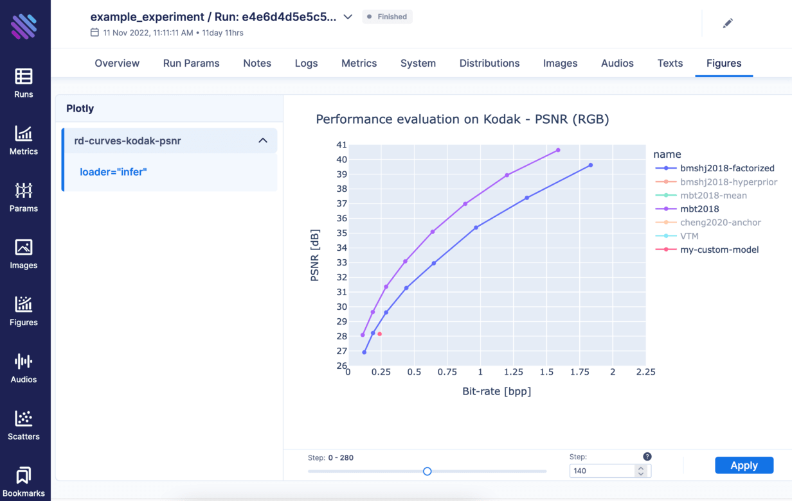

<p align="center">
  
</p>

[](https://github.com/InterDigitalInc/CompressAI-Trainer/blob/master/LICENSE)

CompressAI Trainer is a training platform that assists in managing experiments for end-to-end neural network-based compression research.

CompressAI Trainer integrates with [CompressAI] (library), [Aim] (experiment tracker), [Catalyst] (training engine), and [Hydra] (YAML configuration).

[Aim]: https://aimstack.io/
[Catalyst]: https://catalyst-team.com/
[CompressAI]: https://github.com/InterDigitalInc/CompressAI/#readme
[Hydra]: https://hydra.cc/


|  |
|:--:|
| *CompressAI Trainer integrates with the Aim experiment tracker to display live visualizations of RD curves during training.* |


## Installation

**Requirements:** Python 3.8+.

First, clone the repositories:
```bash
git clone "https://github.com/InterDigitalInc/CompressAI.git" compressai
git clone "https://github.com/InterDigitalInc/CompressAI-Trainer.git" compressai-trainer
```


### Using venv

Create a virtual environment and install as editable:
```bash
python3 -m venv venv
source venv/bin/activate
pip install --upgrade pip
pip install --editable ./compressai-trainer
pip install --editable ./compressai
```


### Using poetry

Poetry helps manage version-pinned virtual environments. First, [install Poetry]:
```bash
curl -sSL https://install.python-poetry.org | python3 -
```

[install Poetry]: https://python-poetry.org/docs/#installation

Then, create the virtual environment and install the required Python packages:
```bash
cd compressai-trainer

# Install Python packages to new virtual environment.
poetry install
echo "Virtual environment created in $(poetry env list --full-path)"

# Link to local CompressAI source code.
poetry run pip install --editable /path/to/compressai
```

To activate the virtual environment, run:
```bash
poetry shell
```


### Development

Installation of dependencies for documentation and development of CompressAI-Trainer
can only be accomplished using poetry from within the `compressai-trainer` folder.
This works with either of the above venv or poetry methods of installation.

```bash
cd ./compressai-trainer
poetry install --only docs
poetry install --only dev
```

You can then build and serve documentation using `make`:

```bash
make docs-serve
```


## Documentation

- [Documentation](https://interdigitalinc.github.io/CompressAI-Trainer/index.html)
- [Walkthrough](https://interdigitalinc.github.io/CompressAI-Trainer/tutorials/full.html) (setup, training, visualizations, configuring, customizing, tips and tricks)


## Usage

Please see the documentation for a complete [walkthrough](https://interdigitalinc.github.io/CompressAI-Trainer/tutorials/full.html).


## Authors

- Mateen Ulhaq, Fabien Racapé, and InterDigital Emerging Technologies Lab.
